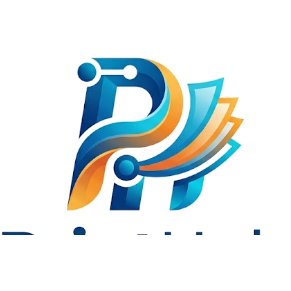

# 🖨️ PrintHub Studio Pro — Professional Photo, Press & Print Suite

<div align="center">



**The Ultimate All-in-One Professional Photo Studio, Press Document Processor, and Direct Hardware Print Workstation.**

[](https://github.com/MS-shishir/printhub)
[](https://react.dev/)
[](https://www.typescriptlang.org/)
[](https://vitejs.dev/)
[](https://www.electronjs.org/)
[](https://github.com/MS-shishir/printhub)

</div>

---

## 🌟 Overview (সফটওয়্যার পরিচিতি)

**PrintHub Studio Pro** হলো ফটো স্টুডিও, প্রেস, সাইবার ক্যাফে এবং ডকুমেন্ট প্রসেসিং সেন্টারের জন্য বিশেষভাবে তৈরি একটি অত্যাধুনিক হাই-পারফরম্যান্স ডেস্কটপ ও ওয়েব অ্যাপ্লিকেশন। এটি তাৎক্ষণিক এআই ব্যাকগ্রাউন্ড রিমুভাল, অফিসিয়াল পাসপোর্ট ও ভিসা ক্রপিং, ব্যাচ প্রিন্ট লেআউট, ডকুমেন্ট স্ক্যান ও অটো-পারসপেক্টিভ কারেকশন, পিডিএফ কম্প্রেশন এবং **সরাসরি প্রিন্টার হার্ডওয়্যার ড্রাইভার (Win32 DEVMODE)** নিয়ন্ত্রণের মাধ্যমে কোনো পপ-আপ ছাড়া সাইডেন্ট প্রিন্টিং সুবিধা প্রদান করে।

---

## 🚀 Core Workspaces & Features (প্রধান ফিচারসমূহ)

```
PrintHub Studio Pro
├── 📸 Passport Studio Pro        (অফিসিয়াল পাসপোর্ট, ভিসা, স্ট্যাম্প ও অ্যালবাম স্টুডিও)
├── 🖼️ Photo Lab Editor           (মাল্টি-লেয়ার ফ্যাব্রিক ক্যানভাস ও ফটো রিটার্চিং)
├── 📄 Document Scanner & PDF     (অফলাইন পিডিএফ ইঞ্জিন, মার্জ, স্প্লিট ও স্ক্যানার)
├── ⚡ Image Optimizer            (এআই সুপার রেজোলিউশন ও হাই-স্পিড কম্প্রেশন)
├── 🌐 Web & Gov Services Link    (সরকারি ও প্রেস সেবাসমূহের কুইক পোর্টাল)
└── 🖨️ Native Print Center        (সরাসরি হার্ডওয়্যার স্পুলার ও DEVMODE নিয়ন্ত্রণ)
```

---

### 1. 📸 Passport Studio Pro (পাসপোর্ট স্টুডিও)
* **Official Country & Embassy Presets:**
  * **বাংলাদেশ**: BD Stamp (25×30mm), BD Mini Stamp (20×25mm), BD Passport (40×50mm), BD Visa (35×45mm), NID Card (25×30mm), Driving License (35×45mm), Joint Passport (55×45mm)।
  * **আন্তর্জাতিক**: USA Visa/Green Card (51×51mm / 2×2"), Schengen Europe (35×45mm), UK Passport (35×45mm), Canada (50×70mm), Saudi Arabia Visa & Hajj (40×60mm), UAE/Dubai (43×55mm), India, Singapore, Malaysia, Australia।
  * **অ্যালবাম ও স্টুডিও প্রিন্ট**: A4 Full Page (210×297mm / ১ ছবি), A4 Half Size Landscape (210×148.5mm / ২ ছবি), A4 Half Size Portrait / A5 (148.5×210mm), A4 Quarter Size / A6 (105×148.5mm / ৪ ছবি), 2R, 3R, 4R (4×6"), 5R (5×7"), 6R (6×8"), 8R (8×10"), 8×12", 10×12", 12×18", 12×24" Full Panoramic Spread।
* **1-Click AI Studio Backgrounds:**
  * হোয়াইট (White), স্কাই ব্লু (Sky Blue), রয়্যাল ব্লু (Royal Blue), পাসপোর্ট স্ট্যান্ডার্ড গ্রে (Gray) এবং কাস্টম স্টুডিও ব্যাকড্রপ।
* **Batch Print Tray (মাল্টি-ফটো প্রিন্ট ট্রে):**
  * একই শিটে একাধিক গ্রাহকের পাসপোর্ট ও স্ট্যাম্প সাইজের ছবি একসাথে সাজিয়ে প্রিন্ট করার সুবিধা।
* **Smart Cutlines & Spacing:**
  * ডট ডট কাটিং লাইন (Dashed Cut Lines) সাথে ০ থেকে ৫ মিমি কাস্টমাইজেবল ফাঁকা এবং কোনা ক্রসহেয়ার এক্সটেনশন।
* **Printer Roller Gripper Safe Zone:**
  * Epson ও Canon প্রিন্টারের নন-প্রিন্টেবল রোলার গ্রিপার মার্জিন গার্ড (৩ মিমি থেকে ১০ মিমি)।

---

### 2. 🖼️ Photo Lab Editor (ফটো ল্যাব এডিটর)
* **Fabric.js 300 DPI Canvas Engine:** হাই-রেজোলিউশন ড্র্যাগ-অ্যান্ড-ড্রপ মাল্টি-লেয়ার আর্কিটেকচার।
* **Studio Retouching Tools:** ফেস স্মুদিং, ব্রাইটনেস, কনট্রাস্ট, স্যাচুরেশন, কালার ব্যালেন্স, ব্লার ও শার্পেনিং।
* **Typography & Graphics:** টেক্সট ওভারলে, ওয়াটারমার্কিং, লোগো স্ট্যাম্প এবং বর্ডার স্টাইলিং।

---

### 3. 📄 Document Scanner & PDF Workspace (ডকুমেন্ট স্ক্যানার ও পিডিএফ)
* **100% Client-Side Offline PDF Engine:**
  * ইন্টারনেটের কোনো প্রয়োজন নেই; সম্পূর্ণ অফলাইনে ব্রাউজার ও ডেস্কটপ মেমরিতে `pdf-lib` ও `pdfjs-dist` দিয়ে প্রসেস হয়।
* **Document Processing Tools:**
  * ৪-পয়েন্ট পারসপেক্টিভ ওয়ার্প (Perspective Warp & Auto-Deskew) — বাঁকা আইডি কার্ড ও সার্টিফিকেট সোজা করা।
  * ডকুমেন্ট ফিল্টার — Black & White Text, Document Clean, Enhance Color, Shadow Removal।
  * PDF Merge (একাধিক ফাইল একত্রীকরণ), Split (আলাদা করা), Page Reorder, এবং Page Rotation।

---

### 4. ⚡ Image Optimizer (ইমেজ অপ্টিমাইজার)
* **Batch Image Compression:** ছবির কোয়ালিটি অক্ষুণ্ণ রেখে ফাইলের সাইজ ৮০-৯০% পর্যন্ত কমানো।
* **Format Conversion:** WebP, PNG, JPEG, TIFF ফরম্যাট কনভার্সন।

---

### 5. 🌐 Web & Gov Services Center (ওয়েব ও সেবা লিংক)
* পাসপোর্ট পোর্টাল, ভোটার এনআইডি উইং, বিআরটিএ সেবা, ই-টিন (e-TIN), জন্ম নিবন্ধন, ভূমি সেবা এবং ট্রেড লাইসেন্স পোর্টালের সরাসরি ইন্টিগ্রেটেড ডিরেক্টরি।

---

### 6. 🖨️ Native Direct Hardware Print Spooler (সরাসরি প্রিন্টার হার্ডওয়্যার ড্রাইভার)
* **C# Win32 GDI+ Engine (`PrintHubSpooler.exe`):**
  * উইন্ডোজের নেটিভ `winspool.drv` এবং `DEVMODEW` স্ট্রাকচার মডিফাই করে সরাসরি প্রিন্টারে পাঠায়।
* **Hardware Media Type Injection:**
  * **Epson Premium Glossy / Ultra Glossy / Photo Paper Glossy**: প্রিন্টারে সরাসরি `DMMEDIA_GLOSSY` পাঠিয়ে গ্লসি পেপারের জন্য সর্বোচ্চ ফটো কোয়ালিটি স্প্রে নিশ্চিত করে।
  * **Epson Matte / Cardstock**: হেভিওয়েট পেপারের জন্য `DMMEDIA_MATTE` পাঠায়।
  * **Plain Paper**: সাধারণ কাগজের জন্য `DMMEDIA_STANDARD` স্পিড মোড সক্রিয় করে।
* **Zero OS Dialog Popups:** উইন্ডোজের সাধারণ ধীরগতির প্রিন্ট ডায়ালগ বাইপাস করে এক ক্লিকে সরাসরি প্রিন্ট শুরু হয়।
* **Manufacturer Preferences Access:** এক ক্লিকে এপসন বা ক্যাননের নিজস্ব প্রিন্টার প্রেফারেন্সেস ডায়ালগ ওপেন করার সুবিধা।

---

## 🛠️ Technology Stack (প্রযুক্তি কাঠামো)

| Layer | Technologies Used |
| :--- | :--- |
| **Frontend UI** | React 19, TypeScript, Vite, Tailwind CSS v4, Lucide Icons |
| **Canvas & Graphics** | Fabric.js v6, HTML5 Canvas 2D, WebGL, High-DPI Matrix Math |
| **AI & Neural Processing** | ONNX Runtime Web (WASM / WebGPU), Mediapipe Selfie Segmentation, Google Gemini API |
| **PDF Processing Engine** | `pdf-lib`, `pdfjs-dist` (Dedicated Inline Web Workers) |
| **Desktop Wrapper** | Electron 34, Node.js, Custom IPC Bridge |
| **Hardware Print Spooler** | C# .NET 8 / Win32 GDI+ API (`winspool.drv`, `DocumentProperties`, `CreateDC`) |

---

## 📦 Installation & Getting Started (ইনস্টলেশন ও রান করার নিয়ম)

### ১. প্রি-রিকুইজিট (Prerequisites)
* [Node.js](https://nodejs.org/) (v18.0 বা তার পরবর্তী সংস্করণ)
* [Git](https://git-scm.com/)

### ২. ক্লোন ও ডিপেনডেন্সি ইনস্টল
```bash
# রিপোজিটরি ক্লোন করুন
git clone https://github.com/MS-shishir/printhub.git

# প্রজেক্ট ডিরেক্টরিতে প্রবেশ করুন
cd printhub

# প্যাকেজ ইনস্টল করুন
npm install
```

### ৩. লোকাল ডেভেলপমেন্ট মোডে রান করুন

* **ওয়েব ব্রাউজার মোড (Web Mode):**
  ```bash
  npm run dev
  ```
  ব্রাউজারে `http://localhost:3000` ওপেন হবে।

* **ডেস্কটপ অ্যাপ্লিকেশন মোড (Desktop Electron Mode):**
  ```bash
  npm run electron:dev
  ```

### ৪. টেস্ট এবং কোড ভ্যালিডেশন
```bash
# স্বয়ংক্রিয় ইউনিট টেস্ট স্যুট চালান (23+ Tests)
npm test

# টাইপচেক ভ্যালিডেশন
npm run lint
```

### ৫. প্রোডাকশন বিল্ড ও ওয়ান-ক্লিক অ্যানিমেটেড ইনস্টলার তৈরি (`.exe` Installer)
```bash
# প্রোডাকশন ওয়েব বান্ডেল তৈরি
npm run build

# প্রিমিয়াম ১-ক্লিক অ্যানিমেটেড উইন্ডোজ ইনস্টলার (.exe) তৈরি (Output: release/ ফোল্ডারে)
npm run electron:build
```
> **✨ ইনস্টলারের বিশেষত্ব:**
> * কোনো পুরাতন উইজার্ড বা ডায়ালগ নেই — Discord/VS Code-এর মতো আধুনিক ১-ক্লিক ইনস্টলার।
> * সুন্দর স্মুথ অ্যানিমেশন এবং PrintHub Pro ব্র্যান্ডিং সহ স্বয়ংক্রিয়ভাবে ২-৩ সেকেন্ডে ইনস্টল হয়ে যায়।
> * ইনস্টলেশন শেষে স্বয়ংক্রিয়ভাবে ডেস্কটপ ও স্টার্ট মেনু শর্টকাট তৈরি করে এবং অ্যাপটি অ্যানিমেটেড স্প্ল্যাশ সহ চালু হয়।

---

## ⌨️ Studio Hotkeys (কীবোর্ড শর্টকাট)

| Shortcut | Action |
| :--- | :--- |
| `Ctrl + S` | ফাইল সেভ / এক্সপোর্ট প্যানেল |
| `Ctrl + P` | সরাসরি কাস্টম প্রিন্ট উইন্ডো ওপেন |
| `Ctrl + Z` | Undo (পূর্বের অবস্থায় ফিরে যাওয়া) |
| `Ctrl + Y` | Redo (পুনরায় করা) |
| `Ctrl + +` / `Ctrl + -` | শিট বা ক্যানভাস জুম ইন / জুম আউট |
| `Ctrl + 0` | জুম রিসেট (100% Fit) |
| `Arrow Keys (↑ ↓ ← →)` | সিলেক্ট করা ছবি ১ মিমি নড়ানো |
| `Shift + Arrow Keys` | সিলেক্ট করা ছবি ৫ মিমি নড়ানো |
| `R` | সিলেক্ট করা ছবি ৯০ ডিগ্রি রোটেট |
| `Delete` / `Backspace` | সিলেক্ট করা ছবি শিট থেকে ডিলিট |

---

## 🔒 Security, Privacy & Offline First (নিরাপত্তা ও গোপনীয়তা)

* **100% Offline Processing:** পাসপোর্ট ছবি ক্রপিং, ব্যাকগ্রাউন্ড রিমুভাল, ডকুমেন্ট স্ক্যান এবং পিডিএফ প্রসেসিং সম্পূর্ণ লোকাল পিসির মেমরিতে সম্পন্ন হয়। গ্রাহকের কোনো ছবি বা ব্যক্তিগত তথ্য কোনো বহিরাগত সার্ভারে আপলোড হয় না।
* **Direct Hardware Isolation:** প্রিন্ট স্পুলার সরাসরি লোকাল উইন্ডোজ প্রিন্ট সার্ভিসের সাথে যোগাযোগ করে।

---

## 📄 License & Copyright

Copyright © 2026 **PrintHub Studio** (Developer: **MS-shishir**). All rights reserved.
Licensed under the [MIT License](LICENSE).
